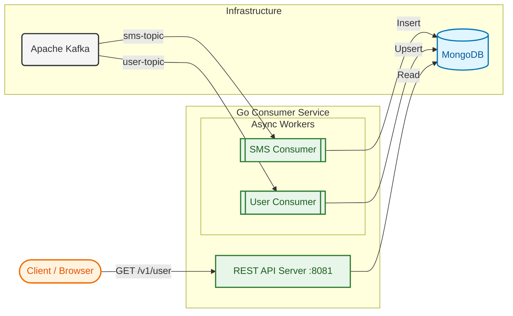
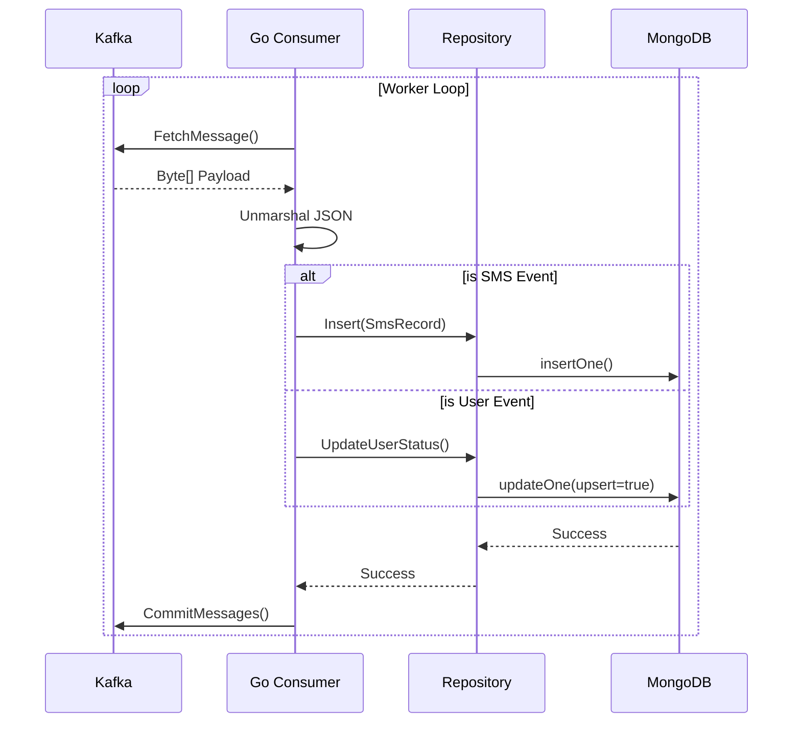
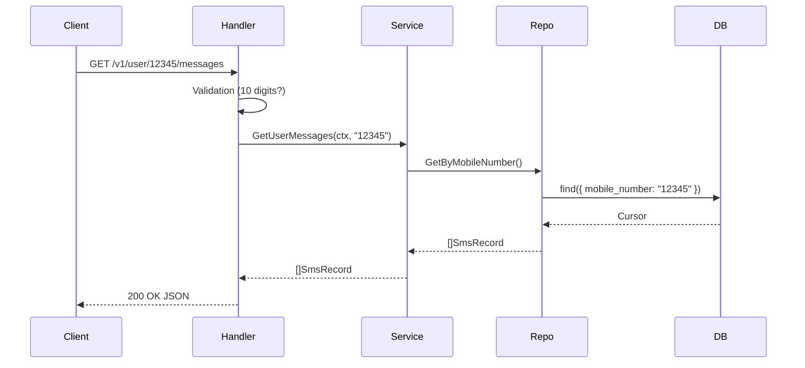

# SMS Consumer Service (Go)

> A high-performance, concurrent backend service written in Go. It consumes SMS and User events from Kafka, persists data into MongoDB, and exposes read-optimized APIs.

## 📋 Table of Contents
1. [Overview](#-overview)
2. [High-Level Design (HLD)](#-high-level-design-hld)
    - [Architecture](#architecture)
    - [Data Flow](#data-flow)
3. [Low-Level Design (LLD)](#-low-level-design-lld)
    - [Component Diagram](#component-structure)
    - [Sequence Diagrams](#sequence-diagrams)
    - [Database Schema](#database-schema)
4. [Tech Stack](#-tech-stack)
5. [API Reference](#-api-reference)
6. [Setup & Configuration](#-setup--configuration)

---

## 🔭 Overview

The **SMS Consumer** acts as the data sink and query layer for the SMS platform. Unlike the synchronous producer service, this service operates asynchronously to handle high throughput without blocking upstream clients.

**Key Features:**
* **Dual Consumers:** Concurrent Goroutines processing `sms-topic` and `user-topic` independently.
* **Idempotency & State:** Uses MongoDB "Upsert" logic to maintain the latest state of user blocklists.
* **Graceful Shutdown:** Handles `SIGTERM` signals to close Kafka readers and Database connections safely.
* **REST API:** Lightweight HTTP server for querying message logs and user status.

---

## 🏗 High-Level Design (HLD)

### Architecture

The system follows a **Worker-Repository Pattern**. The main entry point initializes the database, repositories, services, and finally the Kafka consumers and HTTP server.




### Data Flow

1. **Write Path (Async):**
* **SMS Events:** `Kafka` → `SmsConsumer` → `Unmarshaling` → `SmsRepository` → `MongoDB (Insert)`
* **User Events:** `Kafka` → `UserConsumer` → `Unmarshaling` → `UserRepository` → `MongoDB (Upsert)`


2. **Read Path (Sync):**
* **User History:** `HTTP Request` → `SmsHandler` → `SmsService` → `MongoDB (Find)` → `JSON Response`


---

## ⚙ Low-Level Design (LLD)

### Component Structure

The project follows the standard **Go Project Layout**:

* **`cmd/main.go`**: The application bootstrapper. It injects dependencies (DB → Repo → Service → Handler/Consumer).
* **`internal/kafka`**: Contains the `kafka-go` implementation. It manages the continuous `for` loop that fetches messages.
* **`internal/services`**: Contains business logic (though minimal in a consumer, it acts as a bridge).
* **`internal/repositories`**: Handles `bson` document mapping and MongoDB driver calls.

### Sequence Diagrams

**1. Message Consumption Logic**



**2. API Request Logic**



### Database Schema (MongoDB)

**Collection: `messages`**

* **Index:** `mobile_number` (Ascending)
* **Structure:**
```json
{
  "_id": ObjectId("..."),
  "mobile_number": "String (10 digits)",
  "message": "String (Max 200 chars)",
  "status": "String (SUCCESS/BLOCKED)"
}

```

**Collection: `users`**

* **Index:** `mobile_number` (Unique)
* **Structure:**
```json
{
  "_id": ObjectId("..."),
  "mobile_number": "String",
  "status": "String (BLOCKED/UNBLOCKED)"
}

```

---

## 💻 Tech Stack

* **Language:** Go (Golang) 1.25
* **Database:** MongoDB
* **Messaging:** Apache Kafka (Library: `github.com/segmentio/kafka-go`)
* **Routing:** Native `net/http` ServeMux
* **Driver:** `go.mongodb.org/mongo-driver`

---

## 📖 API Reference

### 1. Get SMS History

Retrieves all messages sent to a specific mobile number.

* **URL:** `/v1/user/{mobileNumber}/messages`
* **Method:** `GET`
* **Success Response:**
* **Code:** 200 OK
* **Content:**
```json
[
    {
        "id": "651a...",
        "mobileNumber": "9876543210",
        "message": "Hello World",
        "status": "SUCCESS"
    }
]

```

### 2. Filter Users

Retrieves a list of users based on their current blocking status.

* **URL:** `/v1/users/{status}/filter`
* **Method:** `GET`
* **Params:** `status` = `BLOCKED` | `UNBLOCKED`
* **Success Response:**
* **Code:** 200 OK
* **Content:**
```json
[
    { "mobileNumber": "9876543210", "status": "BLOCKED" }
]

```

---

## 🚀 Setup & Configuration

### Environment Variables

| Variable | Default | Description |
| --- | --- | --- |
| `MONGO_URI` | `mongodb://localhost:27017` | MongoDB connection string |
| `KAFKA_BROKERS` | `kafka:9092` | Comma-separated list of brokers |