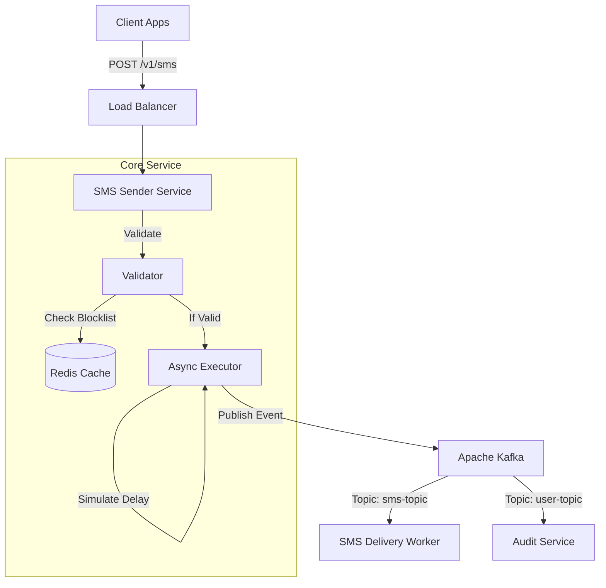
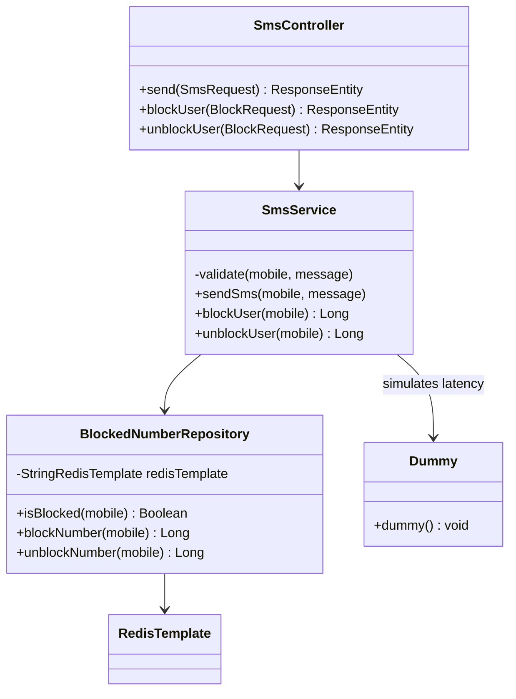

# SMS Sender Microservice

> A high-performance, event-driven Spring Boot microservice designed for asynchronous SMS delivery and real-time user blocklist management using Redis and Kafka.

## 📋 Table of Contents
1. [Overview](#-overview)
2. [High-Level Design (HLD)](#-high-level-design-hld)
    - [Architecture](#architecture)
    - [Data Flow](#data-flow)
3. [Low-Level Design (LLD)](#-low-level-design-lld)
    - [Class Design](#class-diagram)
    - [Sequence Diagrams](#sequence-diagrams)
    - [Database Schema](#database-schema)
4. [Tech Stack](#-tech-stack)
5. [API Reference](#-api-reference)
6. [Setup & Installation](#-setup--installation)

---

## 🔭 Overview

The **SMS Sender** application acts as a gateway for sending SMS notifications. It decouples the incoming HTTP request from the actual delivery process to ensure high throughput and low latency. It features:

* **Non-Blocking I/O:** Immediate `202 ACCEPTED` responses while processing continues in the background.
* **Gatekeeper Logic:** Real-time checking of blocked users via Redis (O(1) complexity).
* **Simulated Latency:** Handles artificial delays (simulating 3rd party gateways) without blocking the main thread.
* **Event Logging:** Publishes delivery attempts and blocking actions to Kafka topics.

---

## 🏗 High-Level Design (HLD)

### Architecture

The system follows an **Event-Driven Architecture**.



### Components

1. **Controller Layer:** The entry point (`SmsController`). It performs fail-fast validation (regex, length) and delegates business logic.
2. **Service Layer:**
* **Validation:** Checks input constraints.
* **Redis Lookup:** Verifies if the user is in the "Blocked" set.
* **Async Handling:** Uses `CompletableFuture` to offload the "sending" logic (which includes a simulated 500ms delay) to a background thread.


3. **Storage Layer (Redis):** Acts as the authoritative source for blocked numbers.
4. **Message Broker (Kafka):**
* `sms-topic`: Queues messages for delivery.
* `user-topic`: Logs blocking/unblocking events.


### Data Flow

1. **Send SMS:**
`Client` → `Controller` → `Redis Check (Pass)` → `Return 202` → `(Async) Sleep 500ms` → `Kafka Produce (SUCCESS)`
2. **Send SMS (Blocked):**
`Client` → `Controller` → `Redis Check (Fail)` → `Kafka Produce (BLOCKED)` → `Return 403`
3. **Block/Unblock User:**
`Client` → `Controller` → `Redis Write` → `Kafka Produce (Audit)` → `Return 200`

---

## ⚙ Low-Level Design (LLD)

### Class Diagram



### Database Schema

**Redis Data Structure**

* **Key:** `blocked_numbers`
* **Type:** `SET`
* **Value:** List of unique mobile numbers (e.g., `"1234567890", "9876543210"`)

**Kafka Payloads**

* **SMS Event:** `{ "mobileNumber": "...", "message": "...", "status": "SUCCESS/BLOCKED" }`
* **User Event:** `{ "mobileNumber": "...", "status": "BLOCKED/UNBLOCKED" }`

---

## 💻 Tech Stack

* **Core:** Java 17+, Spring Boot 3.x
* **Database:** Redis (Spring Data Redis)
* **Messaging:** Apache Kafka (Spring Kafka)
* **Utilities:** Jackson (JSON)
* **Testing:** JUnit 5

---

## 📖 API Reference

### 1. Send SMS

Enqueues a message for delivery.

* **Endpoint:** `POST /v1/sms/send`
* **Headers:** `Content-Type: application/json`
* **Request:**
```json
{
  "mobileNumber": "9876543210",
  "message": "Hello World"
}

```


* **Response (202 Accepted):**
```json
{
  "status": "ENQUEUED",
  "info": "Message enqueued for delivery"
}

```


### 2. Block User

Adds a number to the blocklist.

* **Endpoint:** `POST /v1/sms/block`
* **Request:**
```json
{ "mobileNumber": "9876543210" }

```


* **Response (200 OK):**
```json
{
  "mobileNumber": "9876543210",
  "status": "BLOCKED"
}

```


### 3. Unblock User

Removes a number from the blocklist.

* **Endpoint:** `POST /v1/sms/unblock`
* **Request:**
```json
{ "mobileNumber": "9876543210" }

```


---

## 🚀 Setup & Installation

### Prerequisites

* **Redis** running on `Redis:6379`
* **Kafka** running on `kafka:9092`
* **Java 17+** installed
* **Maven** installed

### Configuration

Update `src/main/resources/application.properties`:

```properties
spring.kafka.bootstrap-servers=kafka:9092
spring.kafka.consumer.group-id=sms-group
spring.data.redis.host=redis
spring.data.redis.port=6379

```

### Troubleshooting

* **"Kafka Warmup Warning":** If Kafka is not running when the app starts, you may see a warning in the logs. The app will still start, but SMS sending will fail until Kafka is up.
* **Redis Connection Refused:** Ensure Redis is running (`redis-cli ping` should return `PONG`).